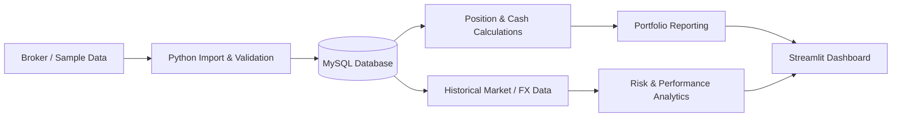

# Financial Portfolio Analytics Dashboard

A personal finance and data-engineering project built with **Python, SQL, MySQL and Streamlit**.

The dashboard combines transaction data, cash movements, market prices and FX rates in a relational database and turns them into portfolio reporting, validation controls and risk analytics.

> **Portfolio version:** This repository contains only sanitized code and synthetic sample data. No personal account information, credentials or original broker exports are included.

## What the project does

- Stores accounts, securities, transactions, dividends, cash movements, prices, FX rates and corporate actions in MySQL
- Reconstructs portfolio positions from transaction history
- Calculates market value, cost basis, realized and unrealized P/L
- Tracks cash balances across currencies and converts values to SEK
- Imports and validates broker transaction data
- Uses transaction hashes for duplicate protection
- Performs cash reconciliation checks during Nordnet imports
- Supports stock splits and other position-history controls
- Downloads and stores historical market and FX data
- Calculates portfolio risk and performance measures
- Compares portfolio performance with market benchmarks
- Presents the results in an interactive Streamlit dashboard

## Why I built it

I wanted a more structured way to consolidate and analyze investment data across multiple accounts and data sources.

What started as a portfolio-tracking project gradually developed into a broader financial data application, with a relational database, automated market-data collection, transaction validation, cash reconciliation and risk analytics.

The project has also been a practical way for me to explore how financial workflows can be made more reliable, repeatable and less dependent on manual processing.

## Screenshots

### Dashboard overview


### Portfolio analytics


### Portfolio allocation and performance


### Portfolio exposure


## Technology

- **Python**
- **SQL / MySQL**
- **Pandas**
- **Streamlit**
- **Plotly**
- **yfinance**

The application is designed for **Python 3.11+**.

## Data workflow



## Selected controls and validation

A major part of the project is data quality rather than visualization alone.

Examples include:

- **Duplicate protection** using transaction hashes
- **Position-history validation** to prevent changes that would create impossible negative holdings
- **Cash reconciliation** when processing Nordnet transaction exports
- **Database rollback** when an import fails
- **Import batch tracking** to support review and undo workflows
- **Restricted database configuration** with credentials kept outside the source code

## Portfolio analytics

The dashboard includes:

- Market value and portfolio allocation
- Cost basis
- Realized and unrealized P/L
- Dividend tracking
- Cash balances
- FX-adjusted portfolio values
- Historical portfolio development
- Annualized return
- Annualized volatility
- Sharpe ratio
- Beta and correlation versus ACWI
- Maximum drawdown
- Benchmark comparison with S&P 500 and OMX Stockholm PI
- Precious-metals exposure and analytics

For Sharpe-ratio calculations, the application can use the Swedish 3-month Treasury-bill series from Sveriges Riksbank as a risk-free proxy.

## Database design

The public schema includes tables for:

- `accounts`
- `assets`
- `transactions`
- `dividends`
- `cash_movements`
- `corporate_actions`
- `prices`
- `fx_rates`
- `import_batches`
- `benchmarks`
- `benchmark_prices`
- `risk_free_rates`

See [`database_schema.sql`](database_schema.sql) for the complete anonymized schema.

## Repository structure

```text
.
├── Dashboard.py
├── database_schema.sql
├── requirements.txt
├── SECURITY_REVIEW.md
├── .gitignore
├── .streamlit/
│   └── secrets.toml.example
└── sample_data/
    ├── README.md
    ├── sample_seed.sql
    └── *.csv
```

## Running the project locally

### 1. Install dependencies

```bash
pip install -r requirements.txt
```

### 2. Create the MySQL schema

Run:

```text
database_schema.sql
```

with a MySQL administrator account.

### 3. Configure database credentials

Copy:

```text
.streamlit/secrets.toml.example
```

to:

```text
.streamlit/secrets.toml
```

and enter the credentials for your **local** MySQL application user.

Do not commit `secrets.toml`.

### 4. Optional: load synthetic sample data

Run:

```text
sample_data/sample_seed.sql
```

The included sample data is fictional and exists only to demonstrate the database structure.

### 5. Start Streamlit

```bash
streamlit run Dashboard.py
```

## Data sources

Depending on the function used, the dashboard can retrieve market or reference data from:

- Yahoo Finance
- Sveriges Riksbank
- Stooq
- Public currency / precious-metal exchange-rate APIs

External data availability and quality depend on those providers.

## Security and privacy

The repository is intended as a portfolio demonstration and uses a sanitized public configuration.

The public version:

- contains no hardcoded database password
- contains no API keys
- contains no personal account identifiers
- contains no original broker transaction exports
- contains no real portfolio database dump

See [`SECURITY_REVIEW.md`](SECURITY_REVIEW.md) for additional details.

## Project status

This is an independently developed personal project and an ongoing learning exercise in financial data management, database design, process automation and analytics.
